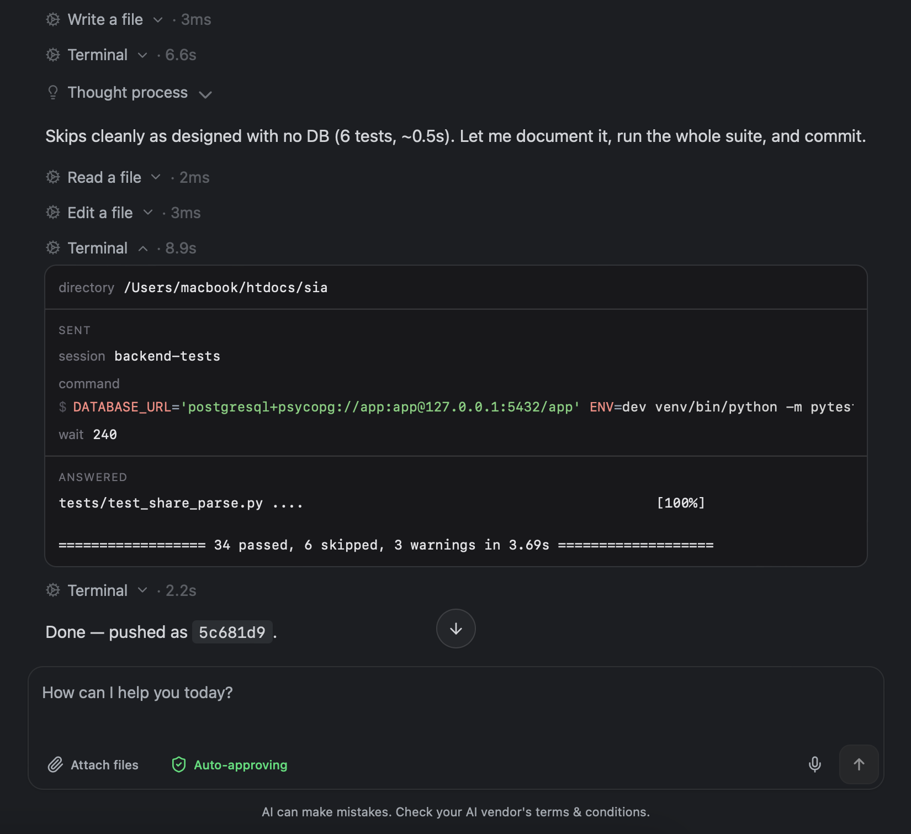
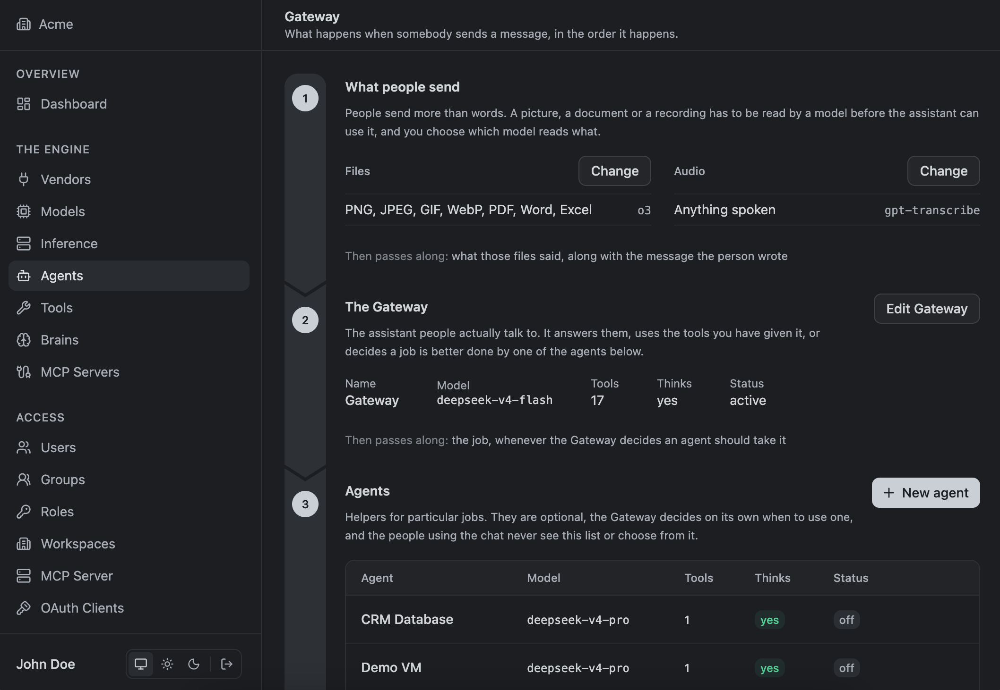

# Flexie SAG

**Smart Agent Gateway.** An AI assistant that runs on your own computer or your
own server, and works with the systems you already have.

Ask it something. It goes and finds out — from your database, your files, your
servers — does the work, and asks you before it changes anything.



## What you can do with it

**Ask questions about a database in plain English.** You decide which tables it
may see and which columns come back empty. Every query is read and checked
before it runs, including through views and subqueries.

**Let it work on your computer.** Read and edit files, search a project, run
commands in a terminal that remembers which folder it is in and what you
exported. Several terminals at once, so a build and a test run do not queue.

**Reach servers only you can see.** One configured server becomes one tool. You
decide which commands may run, and the rule is enforced by reading the command,
not by matching text.

**Give it your own knowledge.** Your policies, your product notes, your way of
doing things, organised so it finds the one page it needs instead of re-reading
everything.

**Choose the models.** Use the providers you already pay for, or run models on
your own GPU. Both look the same to everyone using it.

**Decide who gets what.** People, groups and teams, each with their own models,
tools and knowledge. Permissions are checked on every request, so removing
something takes effect at once.

## Nothing runs without your say-so

Mark a tool as needing approval and the assistant stops, shows you the exact
action, and waits. You approve it or you do not. Nothing happens in between.



The console is where you set all of this up — people, models, tools, agents,
knowledge — and where you watch what is happening right now.

## Two ways to run it

**On your own computer.** One application, carrying its own storage. No server,
no account, nothing to configure. macOS today; Windows is in testing.

**On a server.** One installation your whole company works in, with people,
teams, shared models and shared knowledge.

## What is in here

| | |
|---|---|
| `orchestrator/` | The server. One Go binary, `sag`, with two modes: `server` and `worker`. |
| `chat-ui/` | The chat. React and TypeScript. |
| `admin-ui/` | The console. React and TypeScript. |
| `desktop/` | The desktop applications. Rust and Tauri. |
| `inference/` | The inference node. Runs models on a machine you own. |
| `deploy/` | The production stack: images, compose files, secrets. |

## Getting started

You need Go 1.26, Node 22 and MariaDB 11.4. Rust as well if you are building the
desktop applications.

```sh
make help          # every command, and what it does
make dev           # the server, rebuilt whenever you save
make ui-dev        # the chat, on :5173
make admin-dev     # the console, on :5174
make dev-personal  # the whole desktop product, on :8123
```

Before calling anything done:

```sh
make ci            # format, vet, lint, the Go suite, and both front ends
```

[DEPLOY.md](DEPLOY.md) covers the rest: building and signing each application,
the production deploy, and where every key lives.

## Licence

GNU AGPL v3 or later — see [LICENSE](LICENSE) and [COPYRIGHT](COPYRIGHT).
Copyright © 2026 Flexie.

You can read it, run it, change it and share it. If you modify it and offer it
to other people over a network, your changes have to be available under the same
licence. If that does not suit you, Flexie sells a commercial licence that does
not carry those obligations.

<https://flexie.io>
